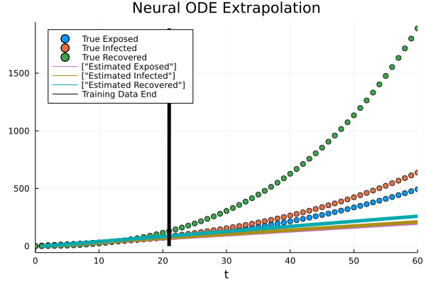
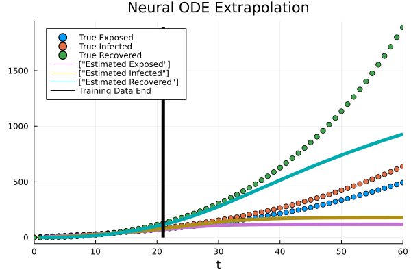

# Inverse problem training on a 7 compartment epidemic model: Forward simulation, Neural ODEs and UDEs.

## Introduction
In this tutorial, we will look at a 7 compartment epidemic model consisting of the following compartments: susceptible, exposed, infected, removed, deaths, cumulative cases and the total population. The dynamics also consists of a time varying contact rate.

## Procedure
- First, we simulate the data from the 7 compartment model. This is a forward simulation using the `Vern7` ODE solver from the `DifferentialEquations.jl` Julia library.
- We then define and train a Neural ODE on the data obtained from this 7 compartment model, where each component term is replaced by a neural network.
- We then turn towards a Universal Differential Equation (UDE) formulation. We assume that the time varying nature of the contact rate is not known. Hence, we replace this term with a neural network. Using this UDE, we again train the model on the underlying data.
- Through the Neural ODE and the UDE training, we shed light on the Optimizer interface  in the SciML Sensitivity tooling of Julia.

## Libraries

```julia

using OrdinaryDiffEq
using ModelingToolkit
using DataDrivenDiffEq
using LinearAlgebra
using Lux,Optimization, OptimizationOptimJL, DiffEqFlux, Flux
using Plots

using Random
rng = Random.default_rng()
```

## Data generation - forward simulation

```julia
function corona!(du,u,p,t)
    S,E,I,R,N,D,C = u
    F, β0,α,κ,μ,σ,γ,d,λ = p
    dS = -β0*S*F/N - β(t,β0,D,N,κ,α)*S*I/N -μ*S # susceptible
    dE = β0*S*F/N + β(t,β0,D,N,κ,α)*S*I/N -(σ+μ)*E # exposed
    dI = σ*E - (γ+μ)*I # infected
    dR = γ*I - μ*R # removed (recovered + dead)
    dN = -μ*N # total population
    dD = d*γ*I - λ*D # severe, critical cases, and deaths
    dC = σ*E # +cumulative cases

    du[1] = dS; du[2] = dE; du[3] = dI; du[4] = dR
    du[5] = dN; du[6] = dD; du[7] = dC
end
β(t,β0,D,N,κ,α) = β0*(1-α)*(1-D/N)^κ
S0 = 14e6
u0 = [0.9*S0, 0.0, 0.0, 0.0, S0, 0.0, 0.0]
p_ = [10.0, 0.5944, 0.4239, 1117.3, 0.02, 1/3, 1/5,0.2, 1/11.2]
R0 = p_[2]/p_[7]*p_[6]/(p_[6]+p_[5])
tspan = (0.0, 21.0)
prob = ODEProblem(corona!, u0, tspan, p_)
solution = solve(prob, Vern7(), abstol=1e-12, reltol=1e-12, saveat = 1)

tspan2 = (0.0,60.0)
prob = ODEProblem(corona!, u0, tspan2, p_)
solution_extrapolate = solve(prob, Vern7(), abstol=1e-12, reltol=1e-12, saveat = 1)

# Ideal data
tsdata = Array(solution)
# Add noise to the data
noisy_data = tsdata + Float32(1e-5)*randn(eltype(tsdata), size(tsdata))

```

## Defining and training a Neural ODE

```julia
### Neural ODE

ann_node = Lux.Chain(Lux.Dense(7, 64, tanh),Lux.Dense(64, 64, tanh), Lux.Dense(64, 64, tanh), Lux.Dense(64, 7))
p1, st1 = Lux.setup(rng, ann_node)
p = Lux.ComponentArray(p1)

function dudt_node(du, u,p,t)
    S,E,I,R,N,D,C = u
    F,β0,α,κ,μ,σ,γ,d,λ = p_
    du[1] = dS =  ann_node([S/N,E,I,R,N,D/N,C], p, st1)[1][1]
    du[2] = dE =  ann_node([S/N,E,I,R,N,D/N,C], p, st1)[1][2]
    du[3] = dI =  ann_node([S/N,E,I,R,N,D/N,C], p, st1)[1][3]
    du[4] = dR =  ann_node([S/N,E,I,R,N,D/N,C], p, st1)[1][4]
    du[5] = dD =  ann_node([S/N,E,I,R,N,D/N,C], p, st1)[1][5]

    du[6] = dN = -μ*N # total population
    du[7] = dC = σ*E # +cumulative cases

    [dS,dE,dI,dR,dN,dD,dC]
end

prob_node = ODEProblem{true}(dudt_node, u0, tspan)


function predict(θ)
    x = Array(solve(prob_node, Tsit5(),p = θ, saveat = 1,abstol=1e-6, reltol=1e-6,
                         sensealg = InterpolatingAdjoint(autojacvec=ReverseDiffVJP(true))))
end

# No regularisation right now
function loss(θ)
    pred = predict(θ)
    loss = sum(abs2, (noisy_data[2:4,:] .- pred[2:4,:]))
    return loss # + 1e-5*sum(sum.(abs, params(ann)))
end

loss(p)

iter = 0
    function callback(θ,l)
      global iter
      iter += 1
      if iter%10 == 0
        println(l)
      end
      return false
    end

adtype = Optimization.AutoZygote()
optf = Optimization.OptimizationFunction((x,p) -> loss(x), adtype)
optprob = Optimization.OptimizationProblem(optf, p)
res1 = Optimization.solve(optprob, ADAM(0.0001), callback = callback, maxiters = 1500)

optprob2 = remake(optprob,u0 = res1.u)

res2 = Optimization.solve(optprob2,Optim.BFGS(initial_stepnorm=0.01),
                                        callback=callback,
                                        maxiters = 10000)


data_pred = predict(res2.u)

# Extrapolate out
prob_node_extrapolate = ODEProblem{true}(dudt_node, u0, tspan2)
_sol_node = Array(solve(prob_node_extrapolate, Tsit5(),p = res2.u, saveat = 1,abstol=1e-12, reltol=1e-12,
                     sensealg = InterpolatingAdjoint(autojacvec=ReverseDiffVJP(true))))

p_node = scatter(solution_extrapolate, vars=[2,3,4], legend = :topleft, label=["True Exposed" "True Infected" "True Recovered"], title="Neural ODE Extrapolation")
plot!(p_node,_sol_node[2,:], lw = 5, label=["Estimated Exposed"])
plot!(p_node,_sol_node[3,:], lw = 5, label=["Estimated Infected" ])
plot!(p_node,_sol_node[4,:], lw = 5, label=["Estimated Recovered"])
plot!(p_node,[20.99,21.01],[0.0,maximum(hcat(Array(solution_extrapolate[2:4,:]),Array(_sol_node[2:4,:])))],lw=5,color=:black,label="Training Data End")

```



We see that the Neural ODE extrapolation is poor. This is because defining a Neural ODE does not incorporate any information regarding the physics of the system. Hence, a Neural ODE is generally poor at forecasting. We now turn towards an UDE where we retain some physics in the system, and replace the missing pieces with a neural network.

## Defining and training a UDE

```julia
### Universal ODE Part 1

ann = Lux.Chain(Lux.Dense(3, 64, tanh),Lux.Dense(64, 64, tanh), Lux.Dense(64, 1))
p1, st1 = Lux.setup(rng, ann)
p = Lux.ComponentArray(p1)

function dudt_(du, u,p,t)
    S,E,I,R,N,D,C = u
    F, β0,α,κ,μ,σ,γ,d,λ = p_
    z = ann([S/N,I,D/N], p, st1)[1][1]
    du[1] = dS = -β0*S*F/N - z[1] -μ*S # susceptible
    du[2] =  dE = β0*S*F/N + z[1] -(σ+μ)*E # exposed
    du[3] =  dI = σ*E - (γ+μ)*I # infected
    du[4] =  dR = γ*I - μ*R # removed (recovered + dead)
    du[5] =  dN = -μ*N # total population
    du[6] =  dD = d*γ*I - λ*D # severe, critical cases, and deaths
    du[7] =  dC = σ*E # +cumulative cases

end


prob_nn = ODEProblem{true}(dudt_,u0, tspan)


function predict(θ)
    x = Array(solve(prob_nn, Tsit5(),p = θ, saveat = solution.t,abstol=1e-6, reltol=1e-6,
                         sensealg = InterpolatingAdjoint(autojacvec=ReverseDiffVJP(true))))
end

# No regularisation right now

function loss(θ)
    pred = predict(θ)
    loss = sum(abs2, (noisy_data[2:4,:] .- pred[2:4,:]))
    return loss # + 1e-5*sum(sum.(abs, params(ann)))
end

loss(p)

iter = 0
    function callback(θ,l)
      global iter
      iter += 1
      if iter%50 == 0
        println(l)
      end
      return false
    end

adtype = Optimization.AutoZygote()
optf = Optimization.OptimizationFunction((x,p) -> loss(x), adtype)
optprob = Optimization.OptimizationProblem(optf, p)
res1 = Optimization.solve(optprob, ADAM(0.01), callback = callback, maxiters = 500)

optprob2 = remake(optprob,u0 = res1.u)

res2 = Optimization.solve(optprob2,Optim.BFGS(initial_stepnorm=0.01),
                                                callback=callback,
                                                maxiters = 550)


uode_sol = predict(res2.u)

# Extrapolate out
prob_nn2 = ODEProblem{true}(dudt_, u0, tspan2)
_sol_uode = Array(solve(prob_nn2, Tsit5(),p = res2.u, saveat = 1,abstol=1e-12, reltol=1e-12,
                     sensealg = InterpolatingAdjoint(autojacvec=ReverseDiffVJP(true))))

p_uode = scatter(solution_extrapolate, vars=[2,3,4], legend = :topleft, label=["True Exposed" "True Infected" "True Recovered"], title="Neural ODE Extrapolation")
plot!(p_uode,_sol_uode[2,:], lw = 5, label=["Estimated Exposed"])
plot!(p_uode,_sol_uode[3,:], lw = 5, label=["Estimated Infected" ])
plot!(p_uode,_sol_uode[4,:], lw = 5, label=["Estimated Recovered"])
plot!(p_uode,[20.99,21.01],[0.0,maximum(hcat(Array(solution_extrapolate[2:4,:]),Array(_sol_uode[2:4,:])))],lw=5,color=:black,label="Training Data End")

```


We can see that the UDE forecasting is much better than the Neural ODE! This can be attributed to some of the system physics being retained in the UDE framework.

Through both the Neural ODE and UDE training procedures, we shed light on how the Optimizer interface (SciML Sensitivity tooling) acts as the interface between equation solvers and automatic differentiation (AD) tooling.
