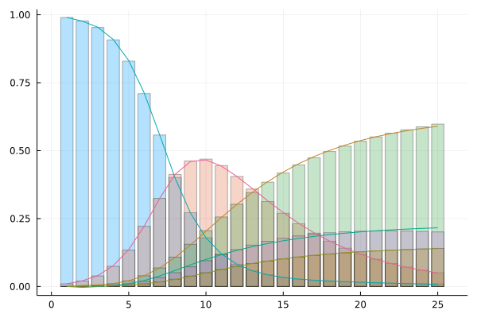

# Training Neural ODEs on epidemiology models in Julia


## Introduction

In this example, we will generate data from a 5 compartment model: Susceptible -> Infected -> Recovered -> Hospitalized -> Deaths. Following this, we will construct a Neural ODE and train it on the data generated by the 5 compartment model. This examples demonstrates the following 3 things:

- How to write a code which integrates neural networks with ODEs in Julia?
- How to optimize the neural network parameters and train the resulting Neural ODE?

## Libraries

```julia
using Lux, DiffEqFlux, DifferentialEquations, Optimization, OptimizationOptimJL, Random, Plots
```
## Data Generation
Generate data which simulates a Susceptible-> Infected -> Recovered -> Hospitalized -> Death scenario.

```julia
rng = Random.default_rng()

const S0 = 1.
u0 = [S0*0.99, S0*0.01, 0., 0., 0.]

p0 = Float64[
    0.85, # τSI
    .1, # τIR
    .05, # τID
    .025, # τIH
    .02, # τHR
    .002 # τHD
    ]

tspan = (0.0, 25)
datasize = 25
t = range(tspan[1],tspan[2],length=datasize)

function SIRHD!(du, u, p, t)
    (S,I,R,H,D) = u

    (τSI, τIR, τIH, τID, τHR, τHD ) = abs.(p)
    du[1] =  - τSI*S*I# S
    du[2] = τSI*S*I - (τIR + τIH + τID )*I # I
    du[3] = τIR*I + τHR*H  # R
    du[4] = τIH*I  - (τHR + τHD)*H # H
    du[5] = τID*I + τHD*H  # D
end

prob = ODEProblem(SIRHD!, u0, tspan, p0)

ode_data = Array(solve(prob, Tsit5(), u0=u0, p=p0, saveat=t))

```

## Constructing a Neural ODE
We will use a single hidden layer with 10 units and a tanh activation function.

```julia
dudt2 = Lux.Chain(
                  Lux.Dense(5, 10, tanh),
                  Lux.Dense(10, 5))
p, st = Lux.setup(rng, dudt2)
prob_neuralode = NeuralODE(dudt2, tspan, Tsit5(), saveat = t)

function predict_neuralode(p)
  Array(prob_neuralode(u0, p, st)[1])
end


function loss_neuralode(p)
    pred = predict_neuralode(p)
    loss = sum(abs2, ode_data .- pred)
    return loss, pred
end

iter = 0
function callback(θ,l)
  global iter
  iter += 1
  if iter%10 == 0
    println(l)
  end
  return false
end


##Optimization of neural network parameters

# Do not plot by default for the documentation
# Users should change doplot=true to see the plots callbacks
losses = Float32[]

callback = function (p, l, pred; doplot = true)
  println(l)
  push!(losses, l)

  # plot current prediction against data
  if doplot && length(losses)%50==0
    plt = scatter(t, ode_data[1,:], label = "data")
    scatter!(plt, t, pred[1,:], label = "prediction")
    display(plot(plt))
  end
  return false
end

pinit = Lux.ComponentArray(p)
callback(pinit, loss_neuralode(pinit)...; doplot=true)

# use Optimization.jl to solve the problem
adtype = Optimization.AutoZygote()

optf = Optimization.OptimizationFunction((x, p) -> loss_neuralode(x), adtype)
optprob = Optimization.OptimizationProblem(optf, pinit)

result_neuralode = Optimization.solve(optprob,
                                       ADAM(0.05),
                                       callback = callback,
                                       maxiters = 300)

optprob2 = remake(optprob,u0 = result_neuralode.u)

result_neuralode2 = Optimization.solve(optprob2,
                                        Optim.BFGS(initial_stepnorm=0.01),
                                        callback=callback,
                                        allow_f_increases = false)

callback(result_neuralode2.u, loss_neuralode(result_neuralode2.u)...; doplot=true)

```

## Visualizing the predictions
```julia
data_pred = predict_neuralode(result_neuralode2.u)
plot()

bar!(ode_data', alpha = 0.3, legend = false)
plot!(data_pred')
```


## Discussion
The fitted model can be seen to give a good fit both to the training data. The training iterations also proceed very fast. 
