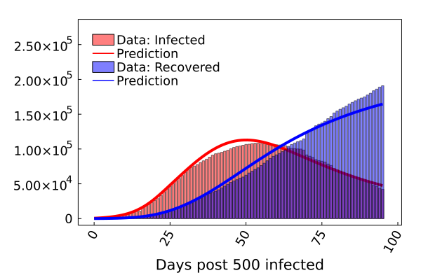
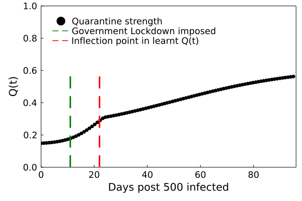

# Integrating neural networks with ODEs: Quarantine strength diagnosis in Italy during March - June 2020

## Introduction
In this tutorial, we will construct a Universal Differential Equation (UDE) based on the SIR model of epidemiology; with the aim of capturing quarantine effects in the region under consideration. We will show that the resulting UDE is not only good at estimation, but can be used as a powerful diagnostic tool. Using this tool, we can understand the real-time, data driven quarantine variation for any region. In this example, we choose Italy.

## Procedure
- First, we need to decide how to construct the UDE model. We will start with the SIR model which has no information regarding quarantine effects. We will integrate a neural network in the SIR model to capture these effects. Intuitively, we know that since quarantine (or isolated) people don't come into contact with the infected people, we need to subtract a term from the dI/dt equation in the SIR model. Thus, we will inject a neural network as a subtraction term in the infected compartment.
- Second, we will train the resulting UDE on the underlying infected and recovered case count data available publicly from the John Hopkins repository.
- Thirdly, after the model is trained, we will plot the neural network recovered quarantine strength with time and see how it relates to the on ground situation in Italy.

## Libraries

```julia
using MAT
using Plots, Measures, Lux
using DifferentialEquations
using DiffEqFlux, Optimization, OptimizationFlux
using Random
```

## Data import and cleanup.

The data consists of infected and recovered case counts post the detection of the 500th infected case (which we will use as t= 0); for Italy. The data is obtained from the publicly maintained John Hopkins repository.

```julia
vars = matread("Rise_Italy_Track.mat")
Random.seed!(50)

Infected = vars["Italy_Infected_All"]
Recovered = vars["Italy_Recovered_All"]
Dead= vars["Italy_Dead_All"]
Time = vars["Italy_Time"]

Infected = Infected - Recovered - Dead
```

## Defining the UDE model.
In this step, we define the α, β parameters of the SIR model and the neural network to capture the quarantine strength. We also define the UDE model as described in the procedure section at the beginning of this tutorial.

```julia
rng = Random.default_rng()
ann = Lux.Chain(Lux.Dense(3,10,relu),Lux.Dense(10,1))
p1, st1 = Lux.setup(rng, ann)

parameter_array = Float64[0.15, 0.013, 0.01]

p0_vec = (layer_1 = p1, layer_2 = parameter_array)
p0_vec = Lux.ComponentArray(p0_vec)

function QSIR(du, u, p, t)
    β = abs(p.layer_2[1])
    γ = abs(p.layer_2[2])
    δ = abs(p.layer_2[3])
    #γ = abs(γ_parameter)
    #δ = abs(δ_parameter)

    UDE_term = abs(ann([u[1]; u[2]; u[3]], p.layer_1, st1)[1][1])

    du[1]=  - β*u[1]*(u[2])/u0[1]
    du[2] = β*u[1]*(u[2])/u0[1] - γ*u[2] - UDE_term*u[2]/u0[1]
    du[3] = γ*u[2] + δ*u[4]
    du[4] =  UDE_term*u[2]/u0[1] - δ*u[4]
end

α = p0_vec

u0 = Float64[60000000.0, 593, 62, 10]
tspan = (0, 95.0)
datasize = 95;

prob= ODEProblem{true}(QSIR, u0, tspan)
t = range(tspan[1],tspan[2],length=datasize)

```

## Defining the loss function and performing the UDE training
We use the ADAM optimizer along with BFGS for optimizing the neural network parameters.

```julia
function predict_adjoint(θ) # Our 1-layer neural network
    x = Array(solve(prob,Tsit5(),p=θ,saveat=t,
                  sensealg=InterpolatingAdjoint(autojacvec=ReverseDiffVJP(true))))
end

function loss_adjoint(θ)
      prediction = predict_adjoint(θ)
      loss = sum(abs2, log.(abs.(Infected[1:end])) .- log.(abs.(prediction[2, :] .+ prediction[4, :] ))) + (sum(abs2, log.(abs.(Recovered[1:end] + Dead[1:end]) ) .- log.(abs.(prediction[3, :] ))))
      return loss
    end


iter = 0
        function callback(θ,l)
          global iter
          iter += 1
          if iter%10 == 0
            println(l)
          end
          return false
        end


adtype = Optimization.AutoZygote()
optf = Optimization.OptimizationFunction((x,p) -> loss_adjoint(x), adtype)
optprob = Optimization.OptimizationProblem(optf, α)
res1 = Optimization.solve(optprob, ADAM(0.01), callback = callback, maxiters = 15000)

optprob2 = remake(optprob,u0 = res1.u)

res2 = Optimization.solve(optprob2,Optim.BFGS(initial_stepnorm=0.01),
                                        callback=callback,
                                        maxiters = 100)


data_pred = predict_adjoint(res2.u)
p3n = res2.u
```
## Obtain Q(t): the neural network recovered quarantine strength

```julia
res2 = Optimization.solve(optprob2,Optim.BFGS(initial_stepnorm=0.01),
                                        callback=callback,
                                        maxiters = 100)


data_pred = predict_adjoint(res2.u)
p3n = res2.u
```

## Plots

1. Data prediction

```julia
bar(Infected',alpha=0.5,label="Data: Infected",color="red")
plot!(t, data_pred[2, :] .+ data_pred[4, :] , xaxis = "Days post 500 infected", label = "Prediction", legend = :topright, framestyle = :box, left_margin = 5mm, bottom_margin = 5mm, top_margin = 5mm,  grid = :off, color = :red, linewidth  = 4, foreground_color_legend = nothing, background_color_legend = nothing, yguidefontsize = 14, xguidefontsize = 14,  xtickfont = font(12, "TimesNewRoman"), ytickfont = font(12, "TimesNewRoman"), legendfontsize = 12)
bar!(Recovered' + Dead',alpha=0.5,xrotation=60,label="Data: Recovered", color="blue")
plot!(t, data_pred[3, :], ylims = (-0.05*maximum(Recovered + Dead),1.5*maximum(Recovered + Dead)), right_margin = 5mm, xaxis = "Days post 500 infected", label = "Prediction ", legend = :topleft, framestyle = :box, left_margin = 5mm, bottom_margin =5mm, top_margin = 5mm, grid = :off, color = :blue, linewidth  = 4, foreground_color_legend = nothing, background_color_legend = nothing,  yguidefontsize = 14, xguidefontsize = 14,  xtickfont = font(12, "TimesNewRoman"), ytickfont = font(12, "TimesNewRoman", legendfontsize = 1))

```


2. Q(t) compared with when lockdown was imposed in Italy.

```julia
scatter(t,Q_parameter/u0[1], xlims = (0, datasize+1), ylims = (0,1), xlabel = "Days post 500 infected", ylabel = "Q(t)", label = "Quarantine strength",color = :black, framestyle = :box, grid =:off, legend = :topleft, left_margin = 5mm, bottom_margin = 5mm, foreground_color_legend = nothing, background_color_legend = nothing,  yguidefontsize = 14, xguidefontsize = 14,  xtickfont = font(12, "TimesNewRoman"), ytickfont = font(12, "TimesNewRoman"), legendfontsize = 12)

D1 = diff(Q_parameter, dims = 1)
D2 = diff(D1, dims = 1)
Transitionn = findall(x -> x <0, D2)[1]

plot!([11-0.01,11+0.01],[0.0, 0.6],lw=3,color=:green,label="Government Lockdown imposed",linestyle = :dash)

plot!([Int(Transitionn[1])-0.01,Int(Transitionn[1])+0.01],[0.0, 0.6],lw=3,color=:red,label="Inflection point in learnt Q(t)",linestyle = :dash)

```



## Discussion

We can see that the time at which an inflection point is seen in the plot of Q(t) matches quite closely with the time at which lockdown was imposed in Italy. This is an indication that the model can be used as a diagnostic tool! We eventually ran this code for 75 different countries and hosted the data publicly at covid19ml.org.

This shows that integrating neural networks with ODE models not only leads to expressive models, but also leads to models which can  be highly interpretable in nature. Such neural network assisted ODE models can be used to capture a wide range of complex effects which are difficult to capture with traditional compartment models or which become too non interpretable with agent based models. Some of these complex effects can be vaccination strength, effects of early reopening, virtual virus spread through Bluetooth tokens etc.
